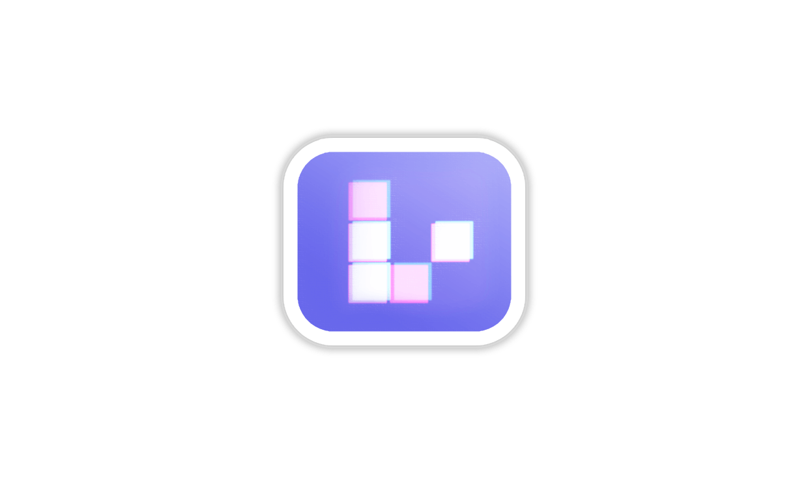

# conways-life

<!-- README_HEAD:START -->

[](https://www.npmjs.com/package/conways-life)
[](./LICENSE)
[](./tsconfig.json)
[](https://github.com/jayf0x/conways-life/actions/workflows/ci.yml)



> ⭐ **Star this [repository](https://github.com/jayf0x/conways-life) if you'd like to support its growth**

<!-- README_HEAD:END -->

A little grid of cells that's born, lives, and dies by three rules a mathematician wrote in 1970.
That's Conway's Game of Life — nothing revolutionary here, it's just fun to watch, and it turns
out to be a great thing to run quietly behind everything else on a page.

**[▶ Live demo](https://jayf0x.github.io/conways-life/)**

## Why this exists

I wanted a Game of Life running as a background — the kind of ambient thing sitting behind your
content, always alive, never asking for CPU you notice. I went looking for a library that would
push the simulation onto the GPU and just went and got out of the way. Couldn't find one: the
WebGPU implementations I found were demos, not libraries, and everything packaged as a library ran
the whole thing on the CPU in JavaScript, which is fine for a small grid but starts to chug once
you want it filling a screen. So: this. It renders on WebGPU compute when your browser has it, and
falls back to plain canvas-2D without you doing anything different, and it's small enough that
adding it to a page shouldn't be a decision you agonize over.

## Features

- **Ambient by default** — drop it on a canvas, it fills the container and runs. No animation loop
  to manage, no game state to hold.
- **WebGPU when available, canvas-2D when not** — same API, same visuals, it just picks the fast
  path silently.
- **Not locked to Conway's own rule** — feed it any birth/survival rule and it'll simulate that
  cellular automaton instead (Day & Night ships as a second preset).
- **Draw on it** — an opt-in interaction layer turns click-and-drag into a paintbrush: draw over
  empty cells, erase over live ones.
- **Bring your own patterns** — gliders, RLE pasted straight from LifeWiki, or hand-rolled ASCII
  art, scattered across the grid on start.
- **Small.** Zero runtime dependencies, a few kilobytes minified.

## Install

```bash
bun add conways-life
```

||

```bash
npm install conways-life
```

## Quick start

```typescript
import { attachDrawInteraction, createLife } from "conways-life";

const canvas = document.querySelector("canvas")!;
const life = createLife(canvas);

// Optional: click-and-drag to draw / erase cells.
attachDrawInteraction(canvas, life);

// life.setPaused(true);
// life.step();
// life.reset();
// life.destroy();
```

That's it for the ambient-background case — one call, it sizes itself to the canvas's container
and starts breathing. Everything else below is for when you want to poke at it.

## Config

```typescript
createLife(canvas: HTMLCanvasElement, config?: LifeConfig): LifeControls
```

| Option       | Type            | Default                | Description                                                                             |
| ------------ | --------------- | ---------------------- | --------------------------------------------------------------------------------------- |
| `rule`       | `LifeRule`      | Conway (B3/S23)        | `{ birth: number[], survive: number[] }` neighbor counts.                               |
| `colors`     | `string[]`      | blue ramp              | CSS colors indexed by live-neighbor count (0..8). Any valid CSS color string.           |
| `patterns`   | `LifePattern[]` | a few small spaceships | Seed patterns, scattered on reset. See below.                                           |
| `targetCols` | `number`        | `80`                   | Approximate column count; cell size derives from container width.                       |
| `cellSize`   | `number`        | —                      | Fixed cell size in px. Overrides `targetCols`.                                          |
| `stepMs`     | `number`        | `240`                  | Milliseconds per generation.                                                            |
| `showGrid`   | `boolean`       | `true`                 | Draw 1px gaps between cells. Can be flipped at runtime too, see `setShowGrid`.          |
| `hoverColor` | `string`        | —                      | Color used by `setHover`/`attachDrawInteraction` for the hovered cell. Omit to disable. |
| `seed`       | `boolean`       | `true`                 | Seed patterns on start/resize.                                                          |

### Patterns

Any of three forms, mixed freely in the same array:

```typescript
"bo$2bo$3o!"[(".O.", "..O", "OOO")][([1, 0], [2, 1], [0, 2])]; // RLE (LifeWiki format, header lines ignored) // row strings — any non-`.`/space char is alive // explicit [x, y] coordinates
```

## Controls

`createLife` returns a `LifeControls`. It's a plain object of imperative methods — no events, no
listeners attached on your behalf. Wire your own input, or use the interaction helper below.

| Member                     | Description                                                                |
| -------------------------- | -------------------------------------------------------------------------- |
| `destroy()`                | Stop the loop, detach listeners, free GPU resources.                       |
| `setPaused(paused)`        | Pause/resume.                                                              |
| `togglePaused()`           | Toggle pause, returns the new state.                                       |
| `step()`                   | Advance exactly one generation (works while paused).                       |
| `reset()`                  | Clear and re-seed.                                                         |
| `setCell(x, y, alive)`     | Set a single cell by grid coordinate.                                      |
| `isAlive(x, y)`            | Whether a cell is alive. Out-of-bounds is `false`.                         |
| `cellAt(offsetX, offsetY)` | Convert canvas-local pixels (`event.offsetX/Y`) to a grid cell.            |
| `setHover(x, y)`           | Highlight a cell with `hoverColor`, or `setHover(null, null)` to clear it. |
| `setShowGrid(show)`        | Toggle grid lines at runtime.                                              |
| `cols`, `rows`, `cellSize` | Current grid dimensions and cell size in px.                               |
| `mode`                     | `"gpu"` once WebGPU init succeeds, otherwise `"cpu"`.                      |

### Drawing on the grid

The engine deliberately doesn't attach mouse or touch listeners itself — one canvas might sit
behind a page where you never want it interactive, another might be the entire app. What it does
give you is enough to build any interaction scheme on top: `cellAt`, `isAlive`, `setCell`,
`setHover`.

For the common case — mouse-down draws, and dragging back over a live cell erases — there's a
ready-made helper:

```typescript
import { attachDrawInteraction } from "conways-life";

const detach = attachDrawInteraction(canvas, life);
// detach() removes the listeners
```

Keyboard shortcuts, touch gestures, anything fancier: write it against the primitives above.

## React

The [live demo](https://jayf0x.github.io/conways-life/) is a small React app (source in
[`demo/`](./demo)) built entirely on the public API — no React-specific build of the library
exists or is needed. The pattern it uses:

```tsx
useEffect(() => {
  const life = createLife(canvasRef.current!, config);
  const detach = attachDrawInteraction(canvasRef.current!, life);
  return () => {
    detach();
    life.destroy();
  };
}, []); // remount (e.g. via a `key`) when `config.rule` needs to change
```

## Development

```bash
bun install
bun run test          # bun test
bun run typecheck
bun run build          # vite → dist/ (ESM + .d.ts)
bun run format         # biome check --write
bun run demo:dev       # local demo site (React)
```

## License

[MIT](./LICENSE) © [jayF0x](https://github.com/jayf0x)
